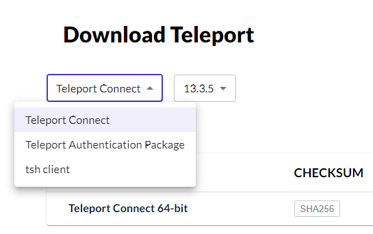

# Client Installation

There are multiple Teleport Clients available for download. A client is required to access Kubernetes clusters and databases.

## Teleport Connect
Teleport Connect is a desktop application that allows you to connect to a Teleport cluster and access resources. It is available for Linux, macOS, and Windows.

[Download Teleport Connect :fontawesome-solid-download:](https://goteleport.com/download/#install-links){ .md-button }

!!! info "Make sure to select Teleport Connect from the dropdown menu"
    

<figure markdown>
  
</figure>

## TSH Client
The TSH Client is a command line tool that allows you to connect to a Teleport cluster and access resources. It is available for Linux, macOS, and Windows.

It includes the following commands:

  - `tsh login` - log in to a Teleport cluster
  - `tsh ssh` - connect to a node or a cluster
  - `tsh db` - connect to a database
  - `tsh status` - show the status of the Teleport cluster
