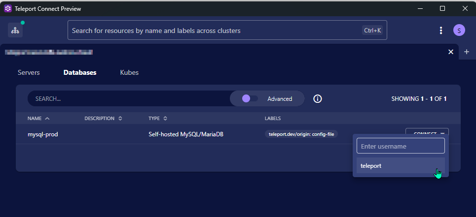
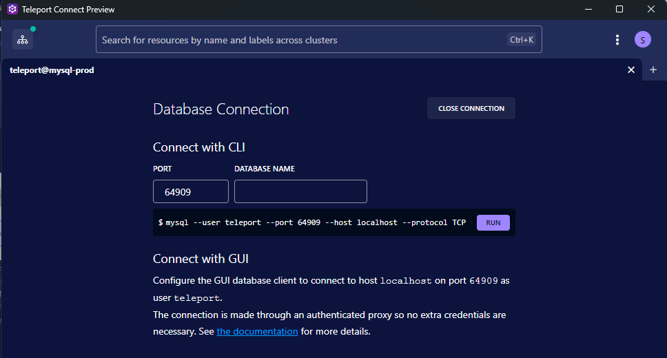
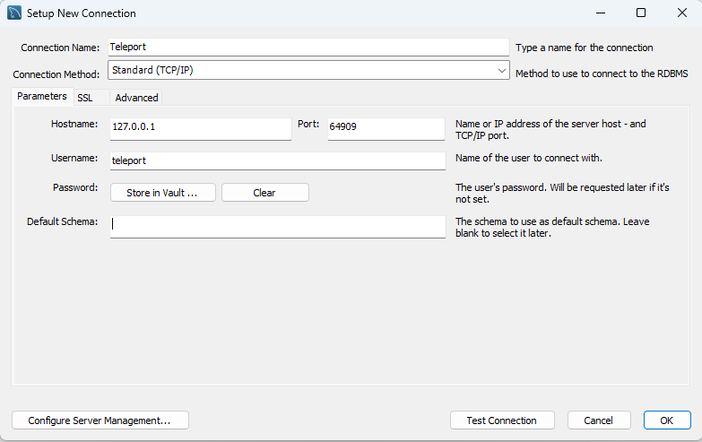

# Accessing MySQL using MySQL Workbench

You can use the Teleport Connect client to access mySQL Databases using MySQL Workbench.

## Prerequisites

- Teleport Connect Client installed on your local machine. See [Installing Teleport Connect Client](/access/teleport/client-installation/) for instructions.
- MySQL Workbench installed on your local machine. See [MySQL Workbench Download](https://dev.mysql.com/downloads/workbench/).

## Client Setup
Launch the Teleport Connect Client and sign in with your account.

Choose the register `Databases` and select `Connect` and the username to connect to the desired MySQL Database server.

After that you will see the forwarded port in the Teleport Connect Client.

!!! note "You can manually set the port, if you do not want a random port to be assigned."

## MySQL Workbench Connection

Launch MySQL Workbench and register a new server.

- Host name: `127.0.0.1`
- Port: `port from teleport client`
- Username: `username from teleport client`
- Password: `leave empty`

