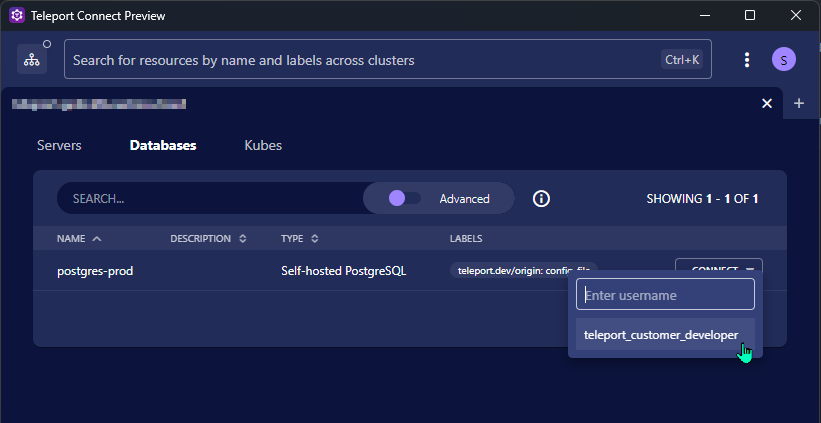
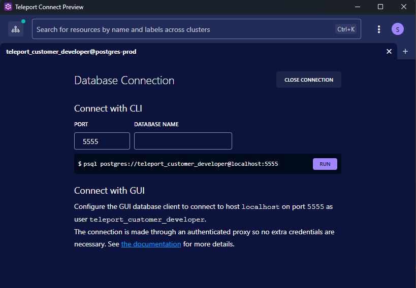
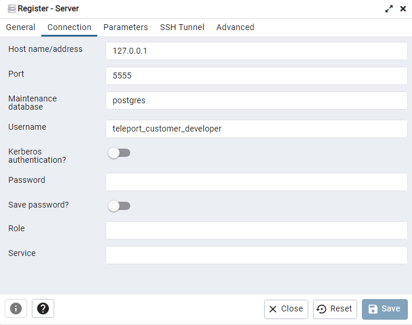

# Accessing PostgreSQL using the Teleport Connect Client

You can use the Teleport Connect client to access PostgreSQL Databases.

## Prerequisites

- Teleport Connect Client installed on your local machine. See [Installing Teleport Connect Client](/access/teleport/client-installation/) for instructions.
- pgAdmin installed on your local machine. See [pgAdmin Download](https://www.pgadmin.org/download/).

## Accessing a PostgreSQL Database
Launch the Teleport Connect Client and sign in with your account.

Choose the register `Databases` and select `Connect` and the username to connect to the desired PostgreSQL Database server.

After that you will see the forwarded port in the Teleport Connect Client.

!!! note "You can manually set the port, if you do not want a random port to be assigned."

## Accessing the PostgreSQL Database using pgAdmin

Launch pgAdmin and register a new server.

- Host name/address: `127.0.0.1`
- Port: `port from teleport client`
- Maintenance database: `postgres`
- Username: `username from teleport client`
- Password: `leave empty`

