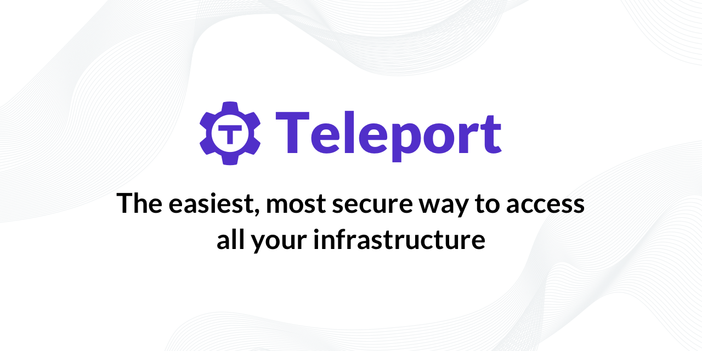

# Teleport

Teleport is an open-source identity-aware access proxy. It provides secure access to anything running behind it using SSH, HTTP, Databases or the Kubernetes API. Teleport is incredibly easy to set up and use.

<figure markdown>
  
</figure>