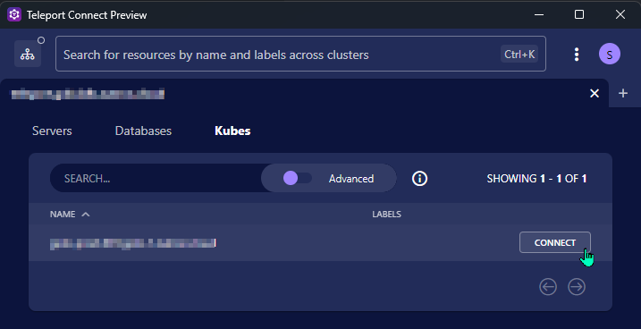
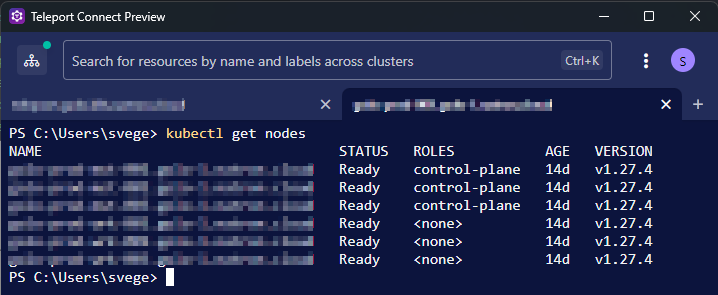

# Accessing Kubernetes Clusters using the Teleport Connect Client

You can use the Teleport Connect client or the `tsh` binary to access Kubernetes clusters.

## Prerequisites

- Teleport Connect Client or TSH Client installed on your local machine. See [Installing Teleport Client](/access/teleport/client-installation/) for instructions.
- Kubectl installed on your local machine. See [Installing kubectl](https://kubernetes.io/docs/tasks/tools/#kubectl) for instructions.
- You must be in a Teleport Role that allows access to Kubernetes clusters.

## Accessing a Kubernetes Cluster using Teleport Connect

Launch the Teleport Connect Client and sign in with your account.

Choose the register `Kubes` and select `Connect` to connect to the Kubernetes cluster.



A new terminal window will open with the `kubectl` context set to the Kubernetes cluster.

Now you can run `kubectl` commands to access the Kubernetes cluster.



## Accessing Kubernetes Clusters using tsh

You can use the Teleport CLI `tsh` to access Kubernetes clusters directly in your terminal.

```bash
TELEPORT_URL=teleport.example.com
TELEPORT_USER=your-teleport-user

# Login to the Teleport cluster
tsh login --proxy=$TELEPORT_URL --auth=local --user=$TELEPORT_USER $TELEPORT_URL

# Print available Kubernetes clusters
tsh kube ls

# Connect to a Kubernetes cluster
tsh kube login <cluster-name>
```
