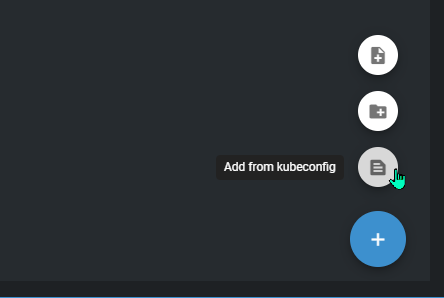
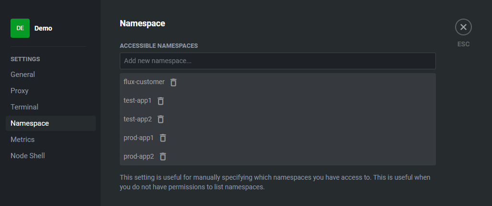
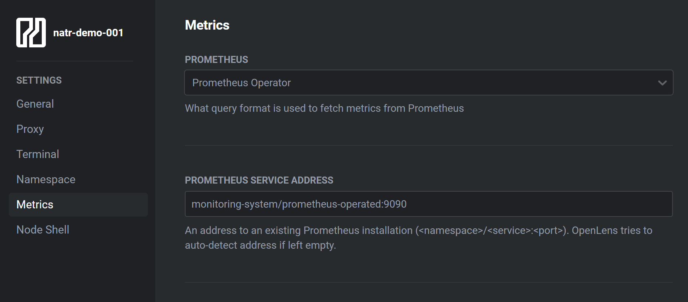
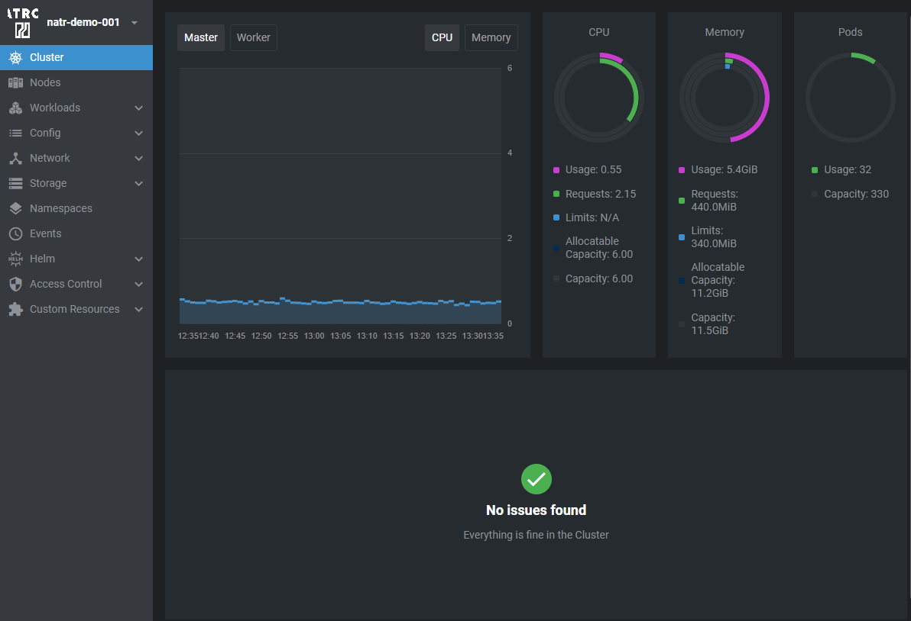

# Accessing Kubernetes Clusters using OpenLens

You can use the Teleport Connect client to access Kubernetes clusters with OpenLens.

## Prerequisites

- Teleport Connect Client installed on your local machine. See [Installing Teleport Connect Client](/access/teleport/client-installation/) for instructions.
- Kubectl installed on your local machine. See [Installing kubectl](https://kubernetes.io/docs/tasks/tools/#kubectl) for instructions.
- OpenLens installed on your local machine. See [OpenLens Releases](https://github.com/MuhammedKalkan/OpenLens/releases) for download.

## Configuring OpenLens to use Teleport Connect

Launch the Teleport Connect Client and sign in with your account.

Choose the register `Kubes` and select `Connect` to connect to the Kubernetes cluster.

A new terminal window will open with the `kubectl` context set to the Kubernetes cluster.

Run the `kubectl config view --flatten` command to print the kubeconfig.
You can now paste the kubeconfig into OpenLens.

## Limited Access to Kubernetes namespaces

If you have limited access to Kubernetes namespaces, you can enter them in the `Kubernetes Namespaces` field inside the OpenLens settings.

## Metrics inside OpenLens

To view metrics inside OpenLens, you need to enable the `Metrics` option inside the OpenLens settings and set the `Metrics Server URL` to `monitoring-system/prometheus-operated:9090`.

