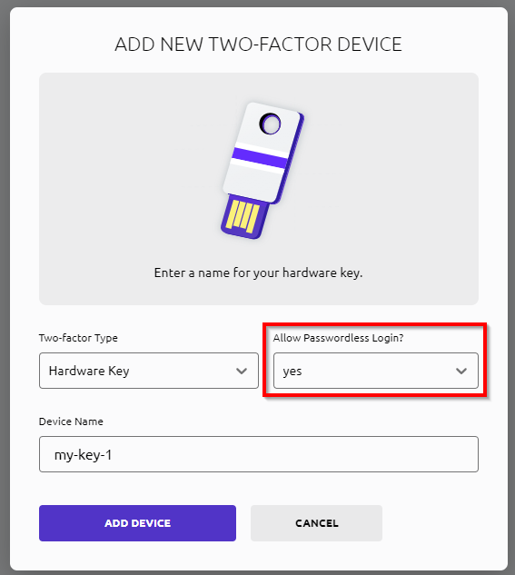
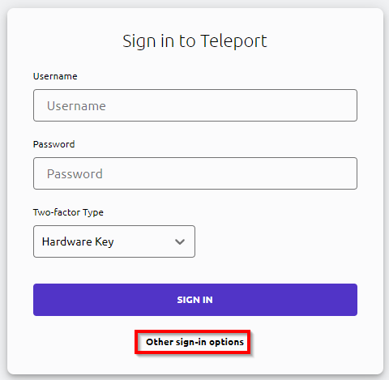

# Passwordless Login

Passwordless login is a way to sign in to Teleport without a password or a username.
This requires special hardware like a security key or a fingerprint reader.

## Prerequisites

- Windows or Mac Device that supports WebAuthn

For passwordless login you can use Windows Hello or Touch ID on Mac.
It is also possible to use a security key like Yubikey.

## Register passwordless login

To register a passwordless login, you need to sign in to the Web Interface.

After that, go to the `Account Settings` page and choose `Two-Factor Devices`.

Add a new device and set Allow Passwordless Login to `Yes`.


??? warning "Using Touch-ID for passwordless sign-in"
    Touch ID registrations are isolated by application. A Touch ID registration for tsh client is different from a registration made from Chrome or Safari. You may register the same Touch ID device from multiple applications to get passwordless access in all of them.

    A signed and notarized version of tsh is required for Touch ID. See [Installing Teleport Connect Client](/access/teleport/client-installation/) for instructions.

    To register passwordless sign-in for tsh client you need to be logged in and run the following command:

    ```bash
    tsh mfa add
    # Choose device type [TOTP, WEBAUTHN, TOUCHID]: WEBAUTHN
    # Enter device name: laptop-1
    # Allow passwordless logins [YES, NO]: YES
    # Tap any *registered* security key
    # Tap your *new* security key
    # MFA device "bio" added.
    ```

## Sign in with passwordless login

For login with passwordless login in the Web Interface, you need to click on the `Other sign-in options` button and select `passwordless login`.



For logging in with passwordless login in the Teleport TSH Client, you need to use the `--auth=passwordless` flag.

```bash
tsh login --proxy=teleport.demo.test --auth=passwordless
```