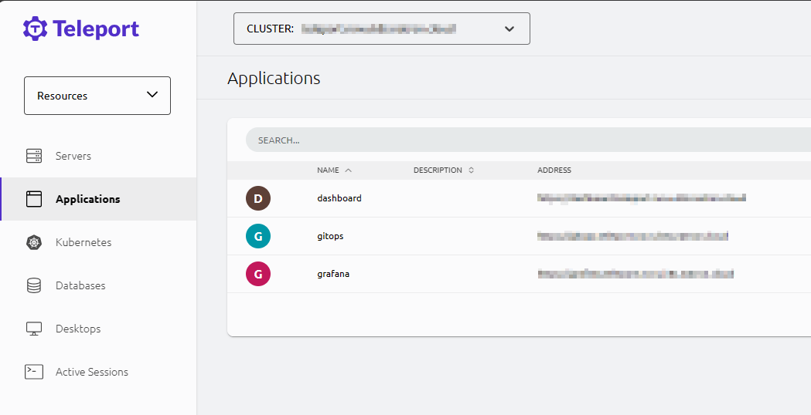

# Accessing Websites using Teleport

You can use any browser to access websites using Teleport.

## Access a Website
Log into the Teleport Web UI and select the `Applications` register.

!!! note
    Use the Teleport Cluster URL, that was provided to you by your administrator.

Each application has its own URL, that you can use to access the website.

!!! tip
    
    You can bookmark the URL for each Application for easy access.